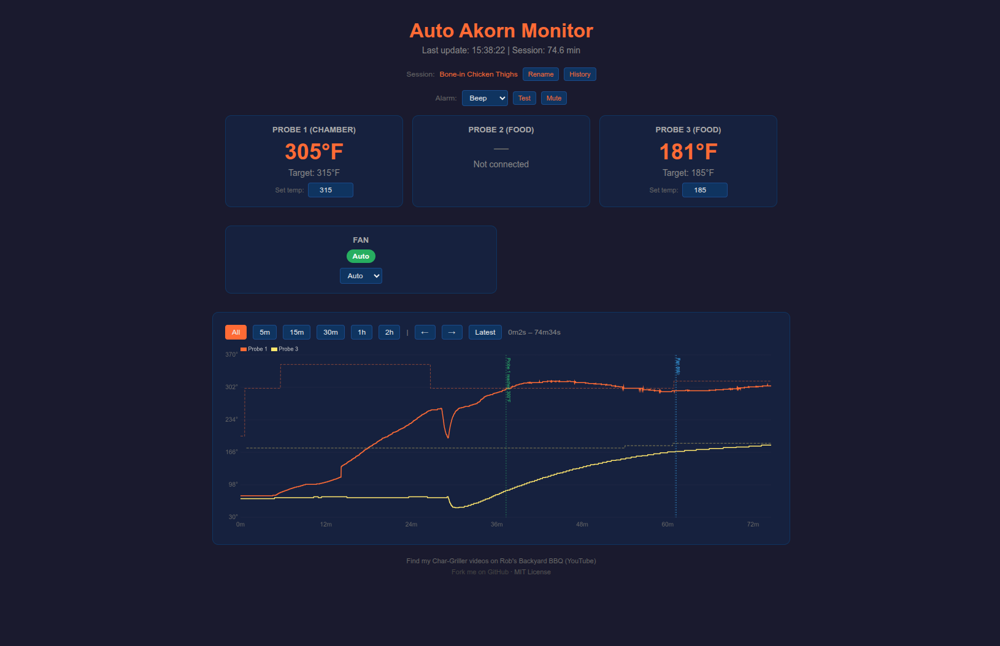

# chargrillerd

Command-line monitor and web dashboard for Char-Griller BBQ temperature controllers. Supports the **Gravity 980** and **Auto Akorn**.

Based on [cg980app](https://github.com/cg980app/cg980app).



## Features

- **Auto-detect device** from BLE scan (Gravity or Akorn)
- **Cross-platform** - macOS and Linux (auto-detected, or use `--platform`)
- **BLE WiFi provisioning** - discovers device, scans for WiFi networks, provisions credentials. No phone app needed.
- **Real-time CLI display** - live-updating terminal UI showing all probes, fan, and alarm state
- **Web dashboard** - dark-themed browser UI with temperature cards, historical graph, and event annotations. Accessible from any device on your local network.
- **Set temperatures from the dashboard** - change chamber and probe targets directly from the browser
- **Fan control** - set fan speed (Off/5/20/40/60/80/100/Auto) from the dashboard
- **Temperature graph** - zoomable/pannable chart with all probe current and target temps plotted over time. Event markers for fan changes, alarm triggers.
- **Session management** - name your cook sessions, browse past sessions, view historical graphs in read-only replay mode
- **Browser-based alarms** - grill alarm triggers audible browser alerts with selectable tones (Beep, Siren, Chime, Urgent) and mute control
- **Configurable notifications** - desktop (macOS/Linux), ntfy, both, or none
- **Session logging** - every reading saved to CSV for post-cook analysis
- **Session resume** - restart the script mid-cook and pick up where you left off
- **Auto-reconnect** - if WiFi drops, retries TCP for 30 seconds, then falls back to BLE re-activation
- **Configurable** - all settings at the top of the script, CLI flags override

## Requirements

- Python 3.12+
- `bleak` for BLE

```bash
pip install bleak
```

## Quick Start

```bash
# Auto-detect device via BLE, provision WiFi
python3 chargrillerd.py

# Connect to known IP (skip BLE)
python3 chargrillerd.py --ip 192.168.x.x

# Force device type
python3 chargrillerd.py --device akorn
python3 chargrillerd.py --device gravity

# Force platform for notifications
python3 chargrillerd.py --platform mac
python3 chargrillerd.py --platform linux

# Specify BLE adapter (multi-adapter systems)
python3 chargrillerd.py --adapter hci2
```

Dashboard at `http://localhost:8080`.

## Device Differences

| Feature | Gravity 980 | Auto Akorn |
|---------|-------------|------------|
| BLE name | `Gravity980-*` | `Akorn-*` |
| Fan display | Yes | Yes (mode + speed) |
| Door sensor | Yes | No (kamado, no door) |
| WiFi info packet | Type 0x07 | Type 0x00/0x20 |

## Status Packet (20 bytes)

| Bytes | Field |
|-------|-------|
| 0-1 | Probe 1 current temp |
| 2-3 | Probe 1 target temp |
| 4 | Alarm state |
| 5 | Reserved |
| 6-7 | Probe 2 current temp |
| 8-9 | Probe 2 target temp |
| 10-11 | Probe 3 current temp |
| 12-13 | Probe 3 target temp |
| 14 | Fan present flag |
| 15 | Door/turbo flags |
| 16 | Fan mode (0x10=auto, 0x00=manual) |
| 17 | Fan speed (0-100%) |
| 18-19 | Unknown |

## Credits

Based on [cg980app](https://github.com/cg980app/cg980app) which reverse-engineered the Char-Griller BLE/WiFi monitoring protocol. Control command set derived from analysis of the official Android client (no longer available from manufacturer).

Much of this code was written with the help of [Claude Code](https://claude.ai/code).
